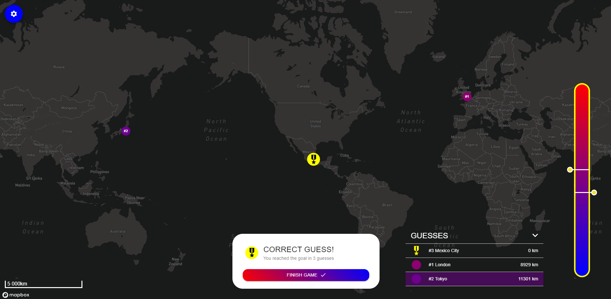
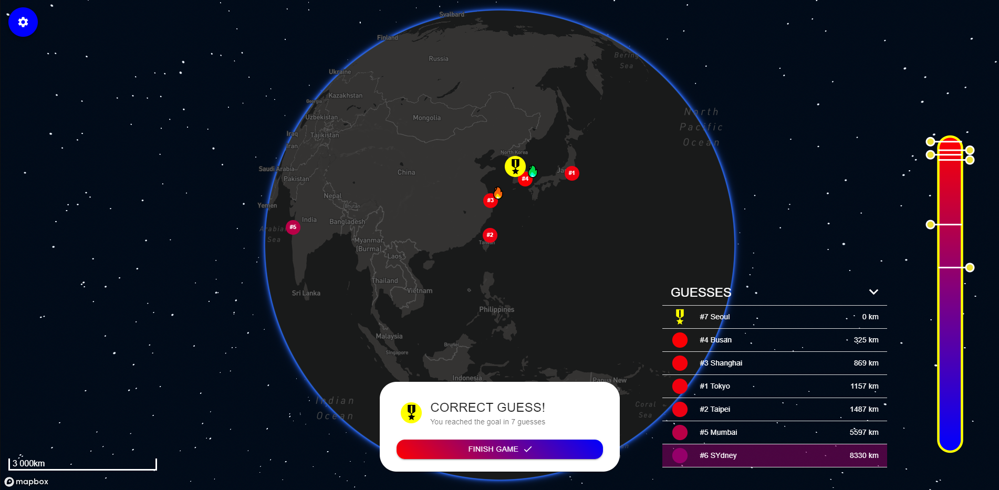
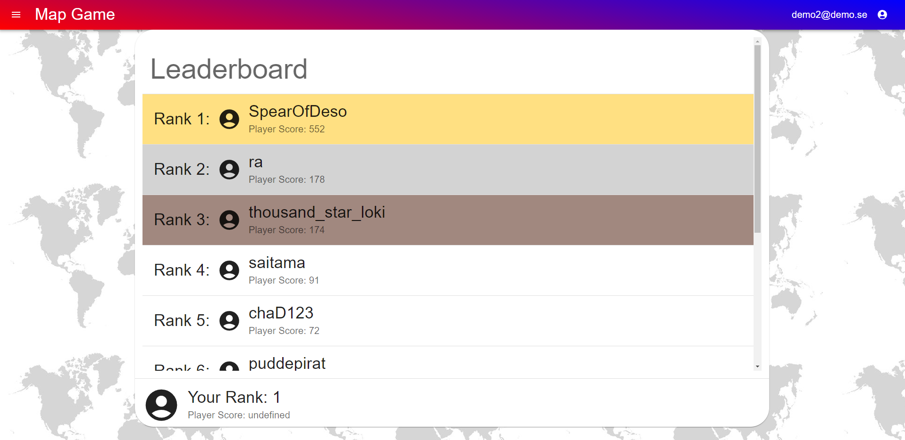

# Map Game
This is a project that me and another developer worked on in 2023. It is a game where one or two players guess a city in the world and get feedback on how close they were to the city chosen by the program. This way the players can continue to guess different cities based on location until they find the right one.

This project was done using React with typescript as framework for the frontend. MAPBOX was used for map functionality in the frontend.
For the backend this project uses serverless setup with Firebase Cloud Functions, Firebase Authentication and Firebase Cloud Firestore.

## Screenshots from the game

## Authors
[Victor Imark](https://github.com/v-imark) & Henrik Gustafsson